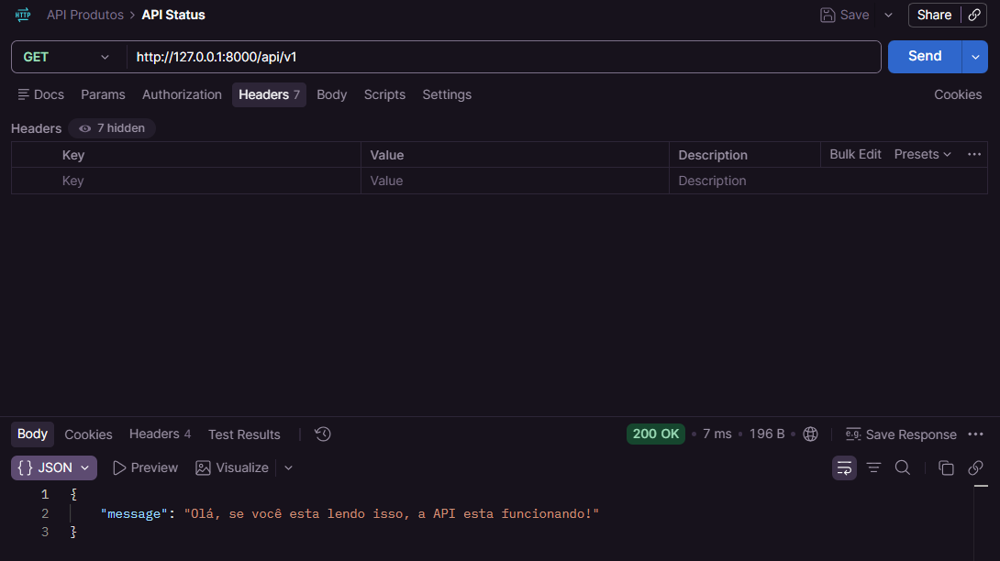
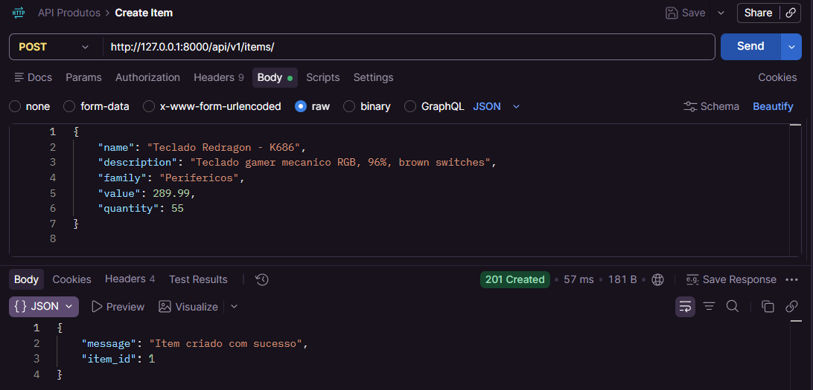
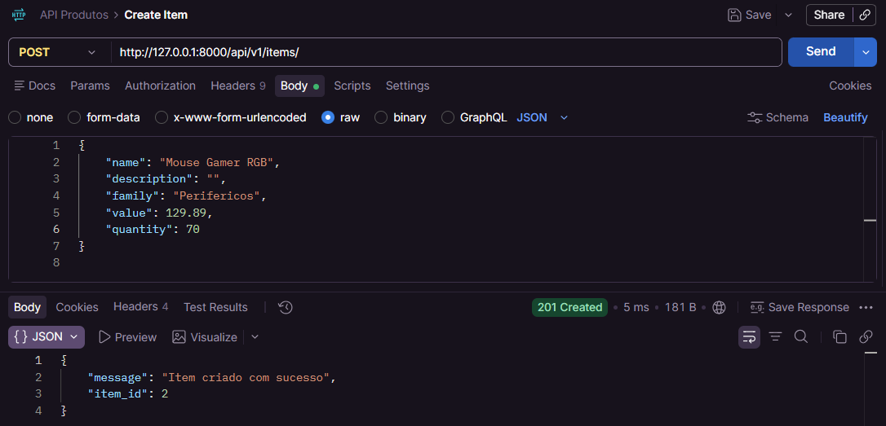
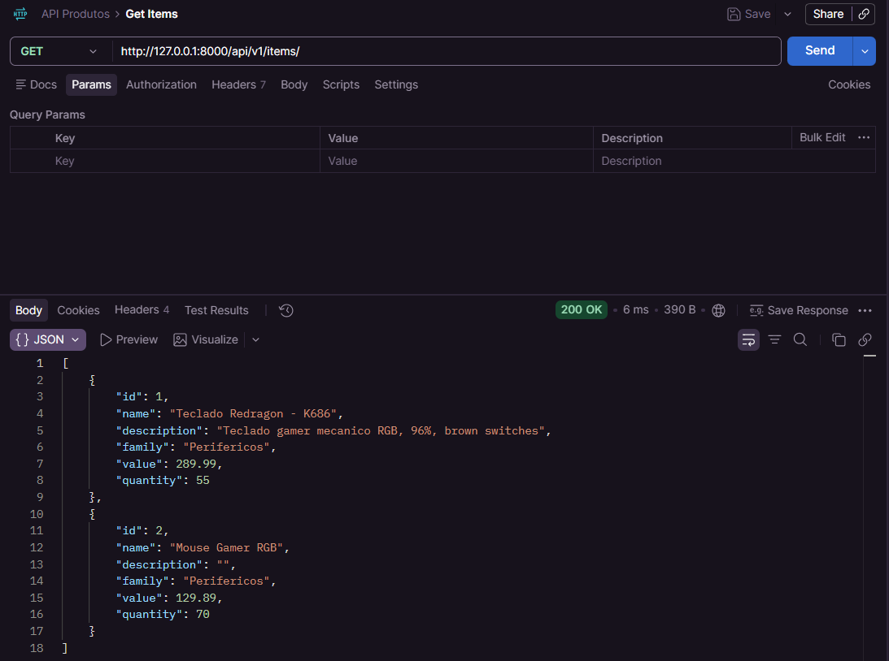
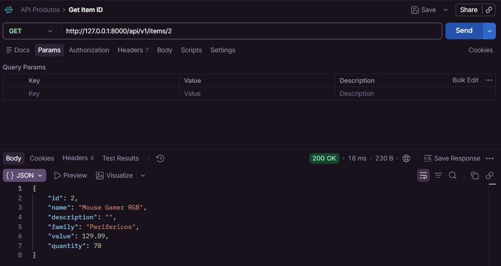
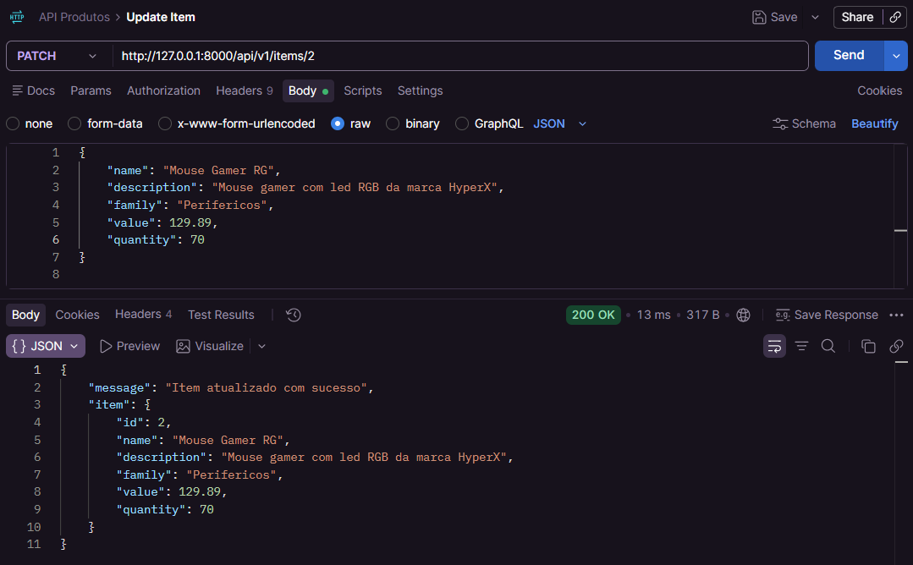
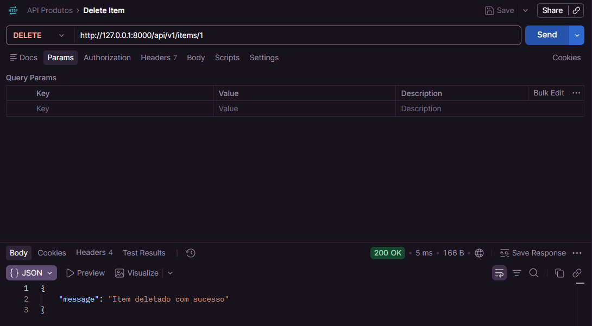
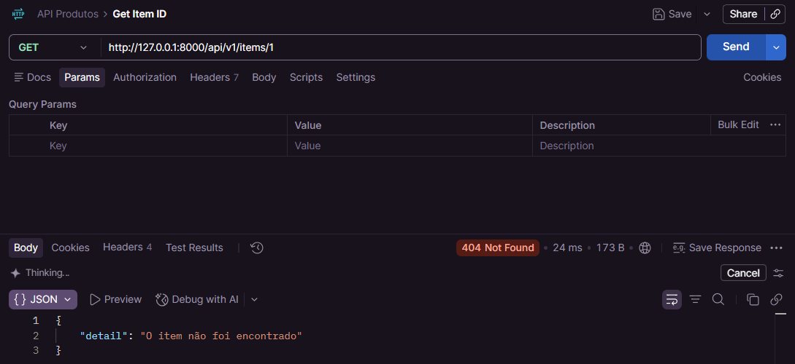

# 🚀 API-produtos

> **API REST desenvolvida em Python com FastAPI, criada como projeto de estudos para consolidar conceitos de Backend, arquitetura em camadas, validação de dados, regras de negócio, persistência e testes automatizados.**

<p align="center">
  
  
  
  
  
</p>

---

## 📌 Sobre o projeto

O **API-produtos** é uma API REST desenvolvida em Python utilizando o framework **FastAPI**.

O projeto foi criado principalmente com o objetivo de estudar e compreender, na prática, como uma aplicação **Backend** é estruturada, como uma requisição percorre suas diferentes camadas e como os dados são validados, processados e armazenados durante esse fluxo.

Mais do que simplesmente implementar um CRUD, o projeto foi utilizado para consolidar conceitos fundamentais de desenvolvimento Backend, desde a chegada de uma requisição HTTP até a construção da resposta enviada ao cliente.

A aplicação utiliza uma arquitetura dividida em responsabilidades, separando:

- 🌐 **Routers** — responsáveis pelos endpoints e comunicação HTTP;
- 📋 **Schemas** — responsáveis pela estrutura, validação e serialização dos dados;
- ⚙️ **Services** — responsáveis pelas regras de negócio;
- 💾 **Repositories** — responsáveis pela manipulação e armazenamento dos dados.

Esse fluxo permitiu compreender de forma prática como diferentes partes de uma aplicação Backend trabalham em conjunto, evitando concentrar toda a lógica em um único arquivo ou camada.

---

## 🎯 Objetivos de estudo

Durante o desenvolvimento, os principais objetivos foram:

- Compreender o funcionamento de uma **API REST**;
- Trabalhar com métodos HTTP e seus respectivos comportamentos;
- Estruturar uma aplicação Backend em diferentes camadas;
- Aprender a separar responsabilidades entre Router, Service e Repository;
- Utilizar **Pydantic** para validação e serialização;
- Implementar regras de negócio;

- Criar respostas padronizadas para os endpoints;
- Desenvolver testes automatizados;


---

# 🏗️ Arquitetura da aplicação

A aplicação foi estruturada seguindo uma divisão de responsabilidades entre diferentes camadas.

```text
                         ┌──────────────────┐
                         │     CLIENTE      │
                         │ Postman / HTTP   │
                         └────────┬─────────┘
                                  │
                                  ▼
                         ┌──────────────────┐
                         │     ROUTERS      │
                         │ Endpoints / HTTP │
                         └────────┬─────────┘
                                  │
                                  ▼
                         ┌──────────────────┐
                         │     SCHEMAS      │
                         │ Pydantic / Dados │
                         └────────┬─────────┘
                                  │
                                  ▼
                         ┌──────────────────┐
                         │     SERVICES     │
                         │ Regras de negócio│
                         └────────┬─────────┘
                                  │
                                  ▼
                         ┌──────────────────┐
                         │   REPOSITORIES   │
                         │ Persistência     │
                         └────────┬─────────┘
                                  │
                                  ▼
                                DADOS
```

### 🔄 Fluxo de uma requisição

De maneira simplificada, o fluxo da aplicação funciona da seguinte forma:

**1. Cliente**

O cliente envia uma requisição HTTP para um endpoint da API.

**2. Router**

O Router recebe a requisição, identifica o endpoint correspondente e encaminha os dados para as próximas camadas.

**3. Schema**

Os dados passam pelos modelos definidos com **Pydantic**, responsáveis por estruturar e validar as informações recebidas.

**4. Service**

A camada de Service aplica as regras de negócio da aplicação. É nesse ponto que são realizadas as validações e decisões relacionadas ao comportamento da operação.

**5. Repository**

O Repository é responsável pela manipulação dos dados, funcionando como a camada responsável pelo armazenamento e recuperação das informações.

**6. Retorno**

Após a operação, o resultado retorna pelas camadas até chegar ao Router, que constrói a resposta HTTP para o cliente.

O resultado pode incluir:

- Código de status HTTP;
- Mensagem específica da operação;
- Dados retornados pela aplicação;
- Informações de erro, quando aplicável.

Essa separação foi uma das partes mais importantes do aprendizado do projeto, pois permitiu compreender na prática **como organizar responsabilidades dentro de uma aplicação Backend**.

---

# 🛠️ Tecnologias utilizadas

| Tecnologia | Utilização |
|---|---|
| 🐍 **Python** | Linguagem principal |
| ⚡ **FastAPI** | Desenvolvimento da API REST |
| 📋 **Pydantic** | Validação e serialização dos dados |
| 🧪 **Pytest** | Execução dos testes automatizados |
| 🧩 **unittest / mock** | Isolamento de componentes durante os testes |
| 📮 **Postman** | Testes funcionais e consumo manual da API |
| 🚀 **Uvicorn** | Servidor ASGI utilizado para executar a aplicação |

---

# 🚀 Como executar o projeto

## 1. Clone o repositório

```bash
git clone https://github.com/CordeiroGusta/API-produtos.git
```

## 2. Acesse a pasta do projeto

```bash
cd API-produtos
```

## 3. Crie o ambiente virtual

```bash
python -m venv .venv
```

## 4. Ative o ambiente virtual

### 🪟 Windows — PowerShell

```powershell
.venv\Scripts\Activate.ps1
```

### 🪟 Windows — CMD

```cmd
.venv\Scripts\activate.bat
```

### 🐧 Linux / 🍎 macOS

```bash
source .venv/bin/activate
```

## 5. Instale as dependências

```bash
pip install -r requirements.txt
```

## 6. Inicie a API

```bash
python -m uvicorn app.main:app --reload
```

Após iniciar o servidor, a API estará disponível, por padrão, em:

```text
http://127.0.0.1:8000
```

A aplicação possui como base de seus endpoints:

```text
/api/v1
```

---

# 📮 Testando a API com Postman

Além dos testes automatizados, o projeto possui uma **coleção do Postman em formato JSON dedicada à API**.

A coleção foi criada para facilitar o consumo e os testes manuais da aplicação.

Qualquer pessoa que tenha acesso ao repositório pode:

1. Clonar o projeto;
2. Iniciar a API;
3. Baixar a coleção JSON;
4. Importá-la no próprio Postman;
5. Executar as requisições e testar os endpoints.

Não é necessário fazer parte do meu workspace do Postman. A coleção é disponibilizada como um arquivo independente.

### 📂 Coleção

A coleção está disponível no projeto em:

```text
postman/
└── API-produtos.postman_collection.json
```

### 📥 Como importar

No Postman:

```text
Import
   ↓
Selecionar o arquivo JSON
   ↓
API-produtos.postman_collection.json
   ↓
Import
```

Após a importação, as requisições estarão disponíveis no workspace do usuário para execução.

A coleção já contém as requisições configuradas para facilitar os testes dos métodos da API.

---

# 🧪 Demonstração do CRUD

A seguir está uma demonstração do funcionamento da API através do Postman.

O fluxo apresentado acompanha uma operação completa sobre os recursos da aplicação: **criação → consulta → consulta individual → atualização → exclusão → validação da exclusão**.

---

## 🟢 Verificando se a API está funcionando

Antes de realizar as operações, é feita uma requisição inicial para verificar se a API está disponível e respondendo corretamente.

<p align="center">
  
</p>

---

## ➕ Criando itens — POST

A criação dos recursos é realizada através do método `POST`.

O cliente envia os dados do novo item no corpo da requisição, que passa pela validação dos Schemas antes de chegar às regras de negócio e ao Repository.

<p align="center">
  
</p>

<p align="center">
  
</p>

---

## 🔎 Consultando os itens — GET

Após a criação, é possível consultar os recursos armazenados através do método `GET`.

<p align="center">
  
</p>

---

## 🔍 Consultando um item específico — GET /{id}

A API também permite consultar individualmente um recurso através do seu identificador.

Neste exemplo, o item de `id = 2` é consultado após sua criação.

<p align="center">
  
</p>

---

## ✏️ Atualizando um item — PATCH

A atualização parcial dos recursos é realizada através do método `PATCH`.

Neste exemplo, o item de `id = 2` é atualizado e a API retorna o resultado da operação.

<p align="center">
  
</p>

---

## 🗑️ Deletando itens — DELETE

A exclusão dos recursos é realizada através do método `DELETE`.

<p align="center">
  
</p>

---

## 🚫 Consultando um recurso deletado

Após a exclusão, é realizada uma nova tentativa de consulta do recurso.

Esse teste demonstra o comportamento da API diante de uma solicitação para um recurso que não está mais disponível.

<p align="center">
  
</p>

Esse fluxo permite visualizar, através do Postman, o comportamento completo do CRUD e das respostas HTTP produzidas pela aplicação.

---

# 🧪 Testes automatizados

Uma das partes fundamentais do projeto foi a implementação de uma suíte de **testes automatizados**.

A aplicação possui aproximadamente **75 testes**, cobrindo os principais módulos da arquitetura:

```text
Tests
│
├── Routers
│   └── Testes dos endpoints e respostas HTTP
│
├── Services
│   └── Testes das regras de negócio
│
└── Repositories
    └── Testes da manipulação dos dados
```

Os testes abrangem tanto cenários de sucesso quanto situações inválidas e casos de borda.

Entre os cenários testados estão:

- Dados válidos;
- Dados inválidos;
- Tipos incompatíveis;
- Campos vazios;
- Strings compostas apenas por espaços;
- Limites de tamanho;
- Recursos inexistentes;
- Operações CRUD;
- Comportamentos esperados das diferentes camadas.

Nos testes relacionados aos Services, também foram utilizados **mocks** para permitir o isolamento da camada de negócio em relação aos Repositories.

Dessa maneira, cada parte da aplicação pode ser validada de forma mais independente.

---

## ▶️ Executando os testes

Com o ambiente virtual ativado e as dependências instaladas, basta executar:

```bash
pytest
```

Esse é o comando básico para executar toda a suíte de testes.

### 🔎 Mais detalhes

Para visualizar informações mais detalhadas durante a execução:

```bash
pytest -v
```

Ou, para uma saída ainda mais detalhada:

```bash
pytest -vv
```

### 📖 Ajuda do Pytest

Para consultar os comandos e opções disponíveis:

```bash
pytest -h
```

---

# 📚 Principais aprendizados

Este projeto foi desenvolvido principalmente como uma forma de **aprender Backend através da prática**.

Ao longo da construção da API, foram consolidados conhecimentos sobre:

### 🌐 APIs REST

Compreensão dos princípios de uma API REST, utilização dos métodos HTTP e construção de endpoints seguindo uma estrutura organizada de recursos.

### 🏗️ Arquitetura em camadas

O projeto permitiu compreender na prática a importância da separação de responsabilidades entre **Router, Schema, Service e Repository**.

### 📋 Validação de dados

Utilização do **Pydantic** para estruturar, validar e serializar os dados que entram e saem da aplicação.

### ⚙️ Regras de negócio

Compreensão da diferença entre simplesmente receber uma requisição e realmente aplicar as regras necessárias antes de realizar uma operação.

### 💾 Persistência

Entendimento do papel de uma camada de Repository e da separação entre a lógica de negócio e a manipulação dos dados.

### 🔄 Fluxo completo de uma requisição

Um dos principais aprendizados foi compreender o caminho percorrido por uma requisição dentro de uma aplicação Backend:

```text
Cliente
   ↓
HTTP Request
   ↓
Router
   ↓
Schema / Pydantic
   ↓
Service
   ↓
Repository
   ↓
Dados
   ↓
Repository
   ↓
Service
   ↓
Router
   ↓
HTTP Response
   ↓
Cliente
```

Isso proporcionou uma visão muito mais ampla de como uma aplicação Backend funciona internamente.

### 🧪 Testes automatizados

Aprendizado sobre criação de testes, organização da suíte de testes, validação de cenários positivos e negativos e utilização de mocks para isolamento das camadas.

### 📮 Testes funcionais

Utilização do Postman para testar a API através da perspectiva de um consumidor externo, verificando endpoints, payloads, respostas e códigos HTTP.

---

# 📈 Evolução durante o projeto

Este projeto também representa uma evolução em relação às primeiras experiências que tive com desenvolvimento de APIs.

O foco deixou de ser apenas **"fazer um endpoint funcionar"** e passou a ser compreender:

> **Como uma requisição entra na aplicação, como os dados são validados, onde as regras de negócio são aplicadas, como os dados são manipulados e como uma resposta é construída e devolvida ao cliente.**

Essa mudança de perspectiva foi um dos principais resultados do projeto.

A construção da API também permitiu consolidar uma visão mais ampla sobre **Backend**, servindo como base para estudos posteriores relacionados a bancos de dados, Docker, autenticação, segurança, integração entre serviços e outras tecnologias do ecossistema.


